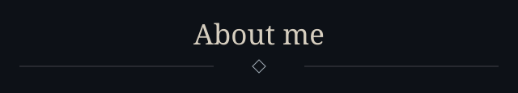
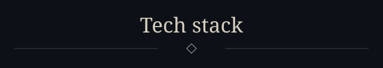
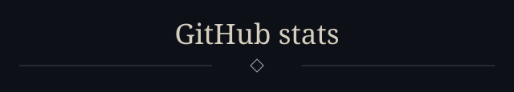
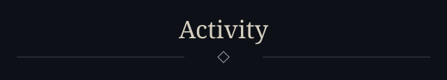

<!-- Ash & iron profile. Keep README.md, assets/, conf/ and .github/workflows/ together. -->

  

  

  

    
    
    
    
    
    
  

  

  

  <table width="100%">
    <tr>
      <td width="55%" valign="middle" align="left">
                <!-- Edit these lines freely — they are the only hand-written text on the page. -->
        
🔥 &nbsp;<strong>Backend &amp; systems engineer.</strong> I build services that keep running long after the bonfire has gone out.

        
⚔️ &nbsp;<strong>Currently forging:</strong> APIs, tooling and automation — written to be read, not just run.

        
📜 &nbsp;<strong>Levelling:</strong> distributed systems, security and performance.

        
💬 &nbsp;<strong>Ask me about:</strong> Linux, Git, Docker, Python, TypeScript, Rust.

        
🛡️ &nbsp;<strong>Creed:</strong> clean architecture, small diffs, no undefined behaviour.

      </td>
      <td width="45%" valign="middle" align="center">
        
      </td>
    </tr>
  </table>

  

  

  <table width="100%">
    <tr>
      <td width="45%" align="center" valign="middle">
        
      </td>
      <td width="55%" align="center" valign="middle">
        
<em>Leave a summon sign — I answer most of them.</em>

        

    
    
    <!-- Add more: LinkedIn, X, website… same badge style, logo names from simpleicons.org -->
        

      </td>
    </tr>
  </table>

  

  <table width="100%">
    <tr>
      <td width="60%" align="center" valign="middle">
  <!-- Edit the icon lists to match your stack: https://skillicons.dev -->
  
WEAPONS · LANGUAGES

  
  
SPELLS · FRAMEWORKS &amp; DATA

  
  
ARMOUR · TOOLS &amp; INFRA

  
      </td>
      <td width="40%" align="center" valign="middle">
        
      </td>
    </tr>
  </table>

  

  <table width="100%">
    <tr>
      <td width="50%" height="220" align="center" valign="middle">
        
      </td>
      <td width="50%" height="220" align="center" valign="middle">
        
      </td>
    </tr>
    <tr>
      <td width="50%" height="220" align="center" valign="middle">
        
      </td>
      <td width="50%" height="220" align="center" valign="middle">
        
      </td>
    </tr>
    <tr>
      <td colspan="2" align="center" valign="middle">
        <picture>
          <source media="(prefers-color-scheme: dark)" srcset="https://raw.githubusercontent.com/0x496C6B696E/0x496C6B696E/output/profile-ash.svg" />
          
        </picture>
      </td>
    </tr>
  </table>

  

  

  <picture>
    <source media="(prefers-color-scheme: dark)" srcset="https://raw.githubusercontent.com/0x496C6B696E/0x496C6B696E/output/github-snake-dark.svg" />
    
  </picture>

  

  

  

