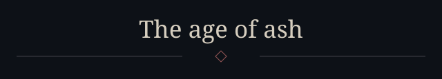
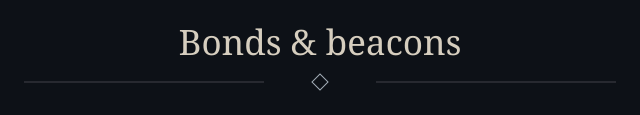
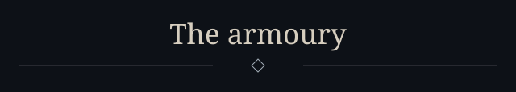
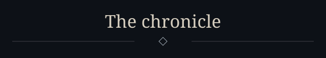
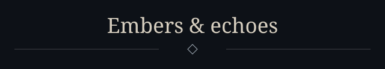
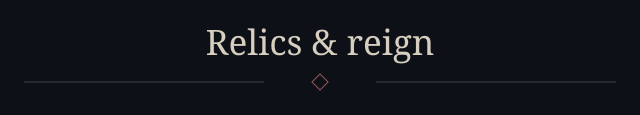

<!-- Ash & iron profile. Keep README.md, assets/, conf/ and .github/workflows/ together. -->

  

  

  

    
    
    
    
  

  

  <!-- ───────────── The age of ash · about ───────────── -->
  

  <table width="100%">
    <tr>
      <td width="55%" valign="middle" align="left">
        <!-- Edit these lines freely — they are the only hand-written text on the page. -->
        
🜂 &nbsp;<strong>Wanderer of the back end.</strong> I build systems that keep working long after the fire has gone out.

        
⚒ &nbsp;<strong>Currently forging:</strong> services, tooling and automation — written to be read, not just run.

        
🜁 &nbsp;<strong>Studying:</strong> distributed systems, security and the quiet art of a good commit message.

        
🜃 &nbsp;<strong>Ask me about:</strong> Linux, Git, Docker, Python, TypeScript, Rust.

        
🜄 &nbsp;<strong>Creed:</strong> clean architecture, small diffs, no undefined behaviour.

      </td>
      <td width="45%" valign="middle" align="center">
        
      </td>
    </tr>
  </table>

  <!-- ───────────── Bonds & beacons · connect ───────────── -->
  

  

    
    
    <!-- Add more: LinkedIn, X, website… same badge style, logo names from simpleicons.org -->
  

  <!-- ───────────── The armoury · tech stack ───────────── -->
  

  <!-- Edit the icon lists to match your stack: https://skillicons.dev -->
  
LANGUAGES

  
  
FRAMEWORKS &amp; DATA

  
  
TOOLS &amp; INFRA

  

  <!-- ───────────── The chronicle · stats ───────────── -->
  

  <table width="100%">
    <tr>
      <td width="50%" height="220" align="center" valign="middle">
        
      </td>
      <td width="50%" height="220" align="center" valign="middle">
        
      </td>
    </tr>
    <tr>
      <td width="50%" height="220" align="center" valign="middle">
        
      </td>
      <td width="50%" height="220" align="center" valign="middle">
        
      </td>
    </tr>
    <tr>
      <td colspan="2" align="center" valign="middle">
        <picture>
          <source media="(prefers-color-scheme: dark)" srcset="https://raw.githubusercontent.com/0x496C6B696E/0x496C6B696E/output/profile-ash.svg" />
          
        </picture>
      </td>
    </tr>
  </table>

  <!-- ───────────── Embers & echoes · activity ───────────── -->
  

  

  <picture>
    <source media="(prefers-color-scheme: dark)" srcset="https://raw.githubusercontent.com/0x496C6B696E/0x496C6B696E/output/github-snake-dark.svg" />
    
  </picture>

  <!-- ───────────── Relics & reign · repos & words ───────────── -->
  

  <table width="100%">
    <tr>
      <td width="50%" align="center" valign="middle">
        
      </td>
      <td width="50%" align="center" valign="middle">
        
      </td>
    </tr>
  </table>

  

  

  

