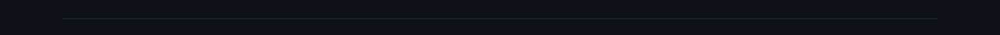

<!-- Upload README.md and the assets folder together to the profile repository. -->

  

  

    
  
<i>Beyond the ruined gates, the watch continues.</i>

   

  <table width="100%">
    <tr>
      <td width="50%" align="center" valign="top">
        
The last sentinel

      </td>
      <td width="50%" align="center" valign="top">
        
Before the first flame

      </td>
    </tr>
  </table>

   
  <h2>Chronicles</h2>
   

  <table width="100%">
    <tr>
      <td width="50%" align="center" valign="top">
        
      </td>
      <td width="50%" align="center" valign="top">
        
      </td>
    </tr>
    <tr>
      <td width="50%" align="center" valign="top">
        <h3>Hall of trophies</h3>
      </td>
      <td width="50%" align="center" valign="top">
        <h3>The realm</h3>
      </td>
    </tr>
    <tr>
      <td width="50%" align="center" valign="top">
        
      </td>
      <td width="50%" align="center" valign="top">
        
      </td>
    </tr>
  </table>

   
  <h2>The archive</h2>
   

  <table width="100%">
    <tr>
      <td width="50%" align="center" valign="top">
        
      </td>
      <td width="50%" align="center" valign="top">
        
      </td>
    </tr>
    <tr>
      <td width="50%" align="center" valign="top">
        
      </td>
      <td width="50%" align="center" valign="top">
        
      </td>
    </tr>
  </table>

   

  <table width="100%">
    <tr>
      <td width="50%" align="center" valign="top">
        
      </td>
      <td width="50%" align="center" valign="top">
        
      </td>
    </tr>
  </table>

   
  

  

    
Artwork credits

    

      <a href="https://wallpapers.com/wallpapers/dark-fantasy-wallpaper-xczk4wwa01ffqnv6.html">Knight &amp; dragon illustration</a>
      · <a href="https://tenor.com/view/dark-souls-elite-knight-fantasy-sword-great-sword-gif-17782074">Knight animation</a>
      · <a href="https://giphy.com/gifs/bandainamco-dark-souls-dsr-remastered-aloKeSXg6qFWi9SSpT">Dragon animation — BANDAI NAMCO</a>
    

  

